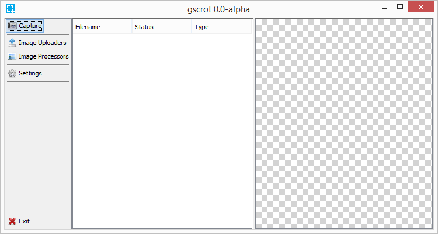
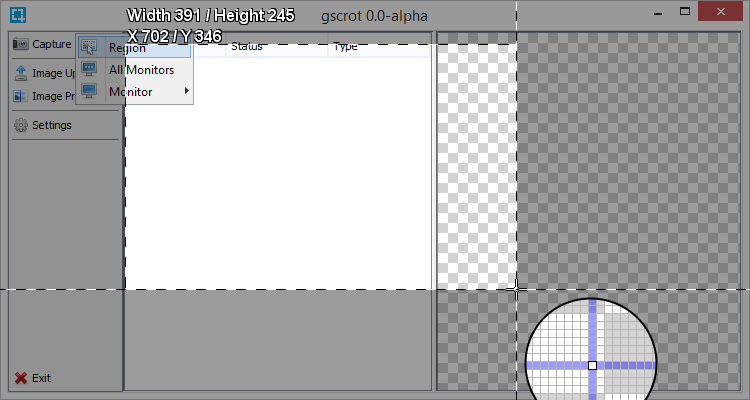

#  gscrot

Cross-platform screenshot capture tool, inspired much by [ShareX](https://github.com/ShareX/ShareX) which sadly is not cross-platform

## Major features

- Capture methods
	- Region
	- Current Monitor
	- Pick Monitor
- Simple API to create modules
	- Capture uploader plugins
	- Uploader example [gscrot-imgur](https://github.com/gscrot/gscrot-imgur)
	- Image Processor plugins, add timestamps and more to image before processing
	- Image Processor example [gscrot-watermark](https://github.com/gscrot/gscrot-watermark)

## Screenshots

_at 287c3ee22222048349ffd543da4e244ed08c33b9_





## Dependencies

- [JNativeHook](https://github.com/kwhat/jnativehook)
- [pluginlib](https://github.com/redpois0n/pluginlib)
- [iconlib](https://github.com/redpois0n/iconlib)
- [statusicon](https://github.com/redpois0n/statusicon)
- [graphslib](https://github.com/redpois0n/graphslib)

## How to build

Compile from source into an runnable JAR with [pyjar](https://github.com/redpois0n/pyjar)

Put pyjar.py in the parent directory of the downloaded source and run

```
python pyjar.py [--jdk /path/to/jdk/bin/] [--classpath pluginlib.jar] --input src --output gscrot.jar --mainclass com.redpois0n.gscrot.Main
```
_path separator depends on system, ; for Windows, : for *nix_

*--jdk argument is only needed if javac isn't in your __$PATH__*

Then you can either double click the JAR or run it using

```
java -jar gscrot.jar
```
